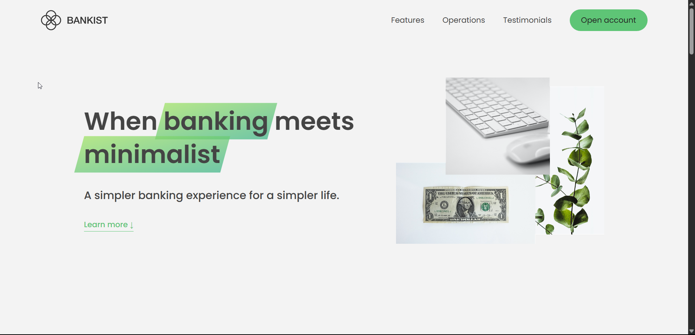

# Bankist: Minimalist Modern Banking Landing Page



A beautiful, interactive, and modern landing page for a fictional digital bank. This project demonstrates advanced DOM manipulation, smooth scrolling, sticky navigation, tabbed components, lazy loading, section reveal animations, and a responsive slider—all with vanilla JavaScript and CSS.

---

## 🚀 Live Demo

[View Live Demo](https://amirreza-ansari.github.io/Bankist-landing-page/)

---

## ✨ Features

- **Modal Window:** Open and close account forms with smooth overlays.
- **Smooth Scrolling:** Effortlessly scroll to sections with a single click.
- **Sticky Navigation:** Navigation bar sticks to the top as you scroll.
- **Section Reveal:** Sections animate into view as you scroll down.
- **Lazy Loading Images:** Images load only when about to enter the viewport for better performance.
- **Tabbed Operations:** Switch between banking operations with a tabbed interface.
- **Slider/Carousel:** Testimonial slider with navigation dots and arrow keys.
- **Navigation Fade Animation:** Navigation links and logo fade on hover for a modern effect.
- **Responsive Design:** Looks great on all screen sizes (add your own media queries for full responsiveness).

---

## 🛠️ Built With

- **HTML5**
- **CSS3** (custom properties, transitions, flexbox, grid)
- **JavaScript (ES6+)** (DOM manipulation, Intersection Observer API, event delegation)

---

## 📂 Project Structure

```
starter/
  ├── index.html
  ├── script.js
  ├── style.css
  └── img/
      ├── hero.png
      ├── logo.png
      ├── icons.svg
      └── ... (other images)
```

---

## 📝 How to Use

1. **Clone the repository:**
   ```bash
   git clone https://github.com/your-username/bankist-landing-page.git
   ```
2. **Open `index.html` in your browser.**
3. **Explore the interactive features!**

---

## 📚 Learning Highlights

- Efficient DOM selection and event handling
- Event delegation for performance
- Intersection Observer API for sticky nav, section reveal, and lazy loading
- Tabbed components and slider logic
- Clean, maintainable code with clear comments

---

## 🙏 Credits

- Design and starter files by [Jonas Schmedtmann](https://twitter.com/jonasschmedtman)
- Project built for learning and portfolio use only

---
